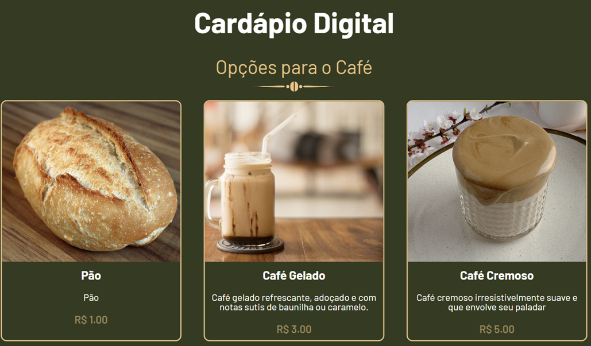
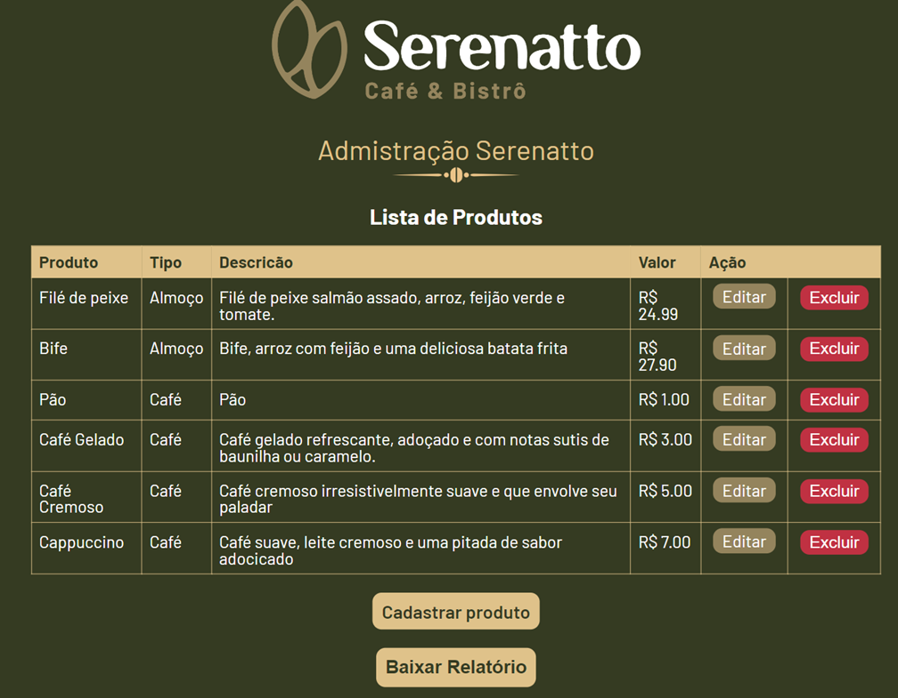

# Serenatto

Aplicação desenvolvida no curso de básico de php - web.
Funciona como um cardápio digital com simples dashboard administrativo e geração de pdf.
#### Desenvolvido com php 8.3.12

### Recursos Estudados
- PHP + HTML
  - Classes
  - Foreach
  - Condicionais
- Banco de dados PDO + MySQL
- Requisições GET e POST
- Recebimento de formulários
- Recebimento de imagens
- Geração de PDF.

<p align="center">

</p>

<p align="center">

</p>

### Execução do App
1. Iniciar container MySQL a partir do docker-compose com ```docker compose up -d```.
2. Executar os arquivos ```sql/create-table.sql``` e ```sql/seed.sql``` no banco de dados.
3. Executar comando ```composer install``` para instalar dependências do projeto.
4. Iniciar servidor com ```php -S localhost:8001 -t public```
