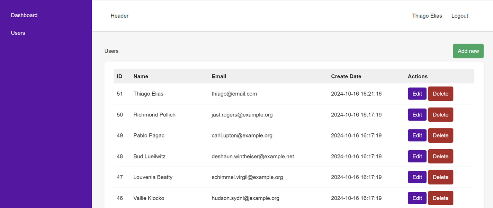
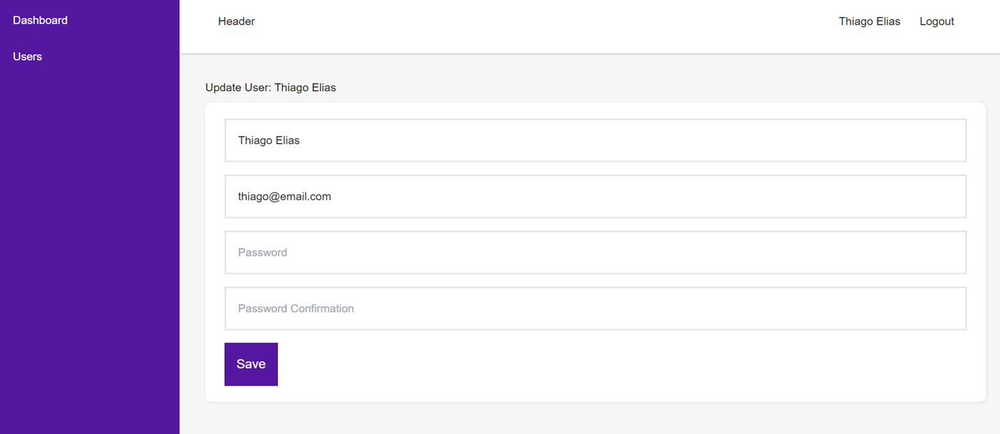

<p align="center"><a href="https://laravel.com" target="_blank"></a></p>

### Objetivo
- Desenvolver uma aplicação fullstack para controle de usuários.
- Backend php Laravel contruido como uma Rest Api.
- Frontend react vite construido como uma SPA.
- Back end e front end são independentes.
- Baseado no vídeo [https://www.youtube.com/watch?v=qJq9ZMB2Was&t=9774s](https://www.youtube.com/watch?v=qJq9ZMB2Was&t=9774s)

<p align="center">


</p>

### Execução do App
1. Iniciar container MySQL a partir do docker-compose com ```docker compose up -d```.
2. Executar comando ```composer install``` para instalar as dependências.
3. Renomear o arquivo **.env.example** para **.env** e preencher os dados da conexão com banco de dados.
4. Executar comando ```php artisan migrate``` para criar o banco de dados (mySql).
5. Executar comando ```php artisan db:seed``` para criar dados no banco de dados.
6. Executar comando ```php -S localhost:8000 -t public``` para iniciar a aplicação.
7. Executar comando ```npm run dev
